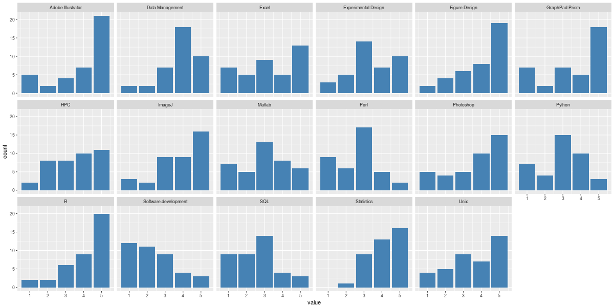

# Overview of Bioinformatics Training at CRUK C.I.
### Mark Dunning, Cancer Research Uk Cambridge Institute
### Uk Bioinformatics Core Facilities Meeting
### July 4th 2017
---

# How we started

In the early days of the group we were running:-

- Stats course using GraphPad Prism
  + 3,4 times a year
- Microarray Analysis in Bioconductor
  + once a year
- Experimental Design
  + once a year
- In 2016 we contributed to 60 days of training

---

# What Changed

- Our new Institute Director (a statistican) banned GraphPad Prism :+1:
- Pressure from steering committee to provide more training
- Our Institute joined the University
- We got more involved with teaching at the University level
- A permanent training role
  + me!
  + funded externally to the Core
  
---

# What to teach

Decisions based on:-

- Demands from user (see next slides)
- Topics with existing materials
- Tools / techniques where best practices are established
  + RNA-seq
- Tools that encourage independance and data exploration
  + e.g. browsers, web-based
- Promoting better communication between wet-lab and Bioinformatician
    + so they know what is possible 
    + speed-up the process of completing a project

---

# Institute-wide survey - February 2016

> For each of the skills listed below, please rate from 1 to 5 how useful it would be to receive training in this area

---

# Know your audience

Take RNA-seq;

- Do people want to run the analysis themselves?
- Or understand the basics and be able to interpret the output
  + maybe do some downstream analysis?
- In our case it seems to be a mix of the two
- Influence on choice of software
  + R, jupyter notebook?
  + Galaxy?

---

# What we give them!

- R
  + Introductory 
  + Intermediate (with dpylr and ggplot2)
- Statistics
  + using "Shiny"
- Python
- Galaxy Introduction
- RNA-seq / ChIP-seq
- Experimental Design
- Data Management
- IGV
- Unix
- github
- Figure Design

---

# Availability of Materials

http://www.cruk.cam.ac.uk/core-facilities/bioinformatics-core/training

---

#  Case Study: Intermediate R
- http://bioinformatics-core-shared-training.github.io/r-intermediate/
- A one-day course to teach dplyr and ggplot2
- Three individuals involved in creating materials
  + Mark Dunning, Matt Eldridge (CRUK CI), Thomas Carroll (MRC CSC, now Rockefeller Institute)
- Back of envelope estimate; around 100 hours preparation time
- Materials created and presented in RStudio markdown
  + Mixture of walkthrough and exercises
- Materials available on github
- Sell-out course (46 seats) every time, usually with waiting list
  + 4 /5 times run since April 2016

---

# Benefits to the Core

- Visibility
- Create links with community
- Better interactions between Bioinformatician and Biologist
- Feedback after course is usually positive
  + but we haven't assessed long-term feedback yet
- Fun!

---

# It might not be as hard as you think

- Plenty of resources out there
  + beg, (steal), borrow!
- Technologies for easier creation of materials
  + Rstudio, jupyter notebooks
- Technologies for easier software setup and deployment
  + Virtual Machines, Docker, Cloud compute
  
---

# Let's work together on this

---
# And finally

---

# Extra

Number of CRUK C.I. employees attending a course 
  + both internally and at University facilities

---

# Extra

---

